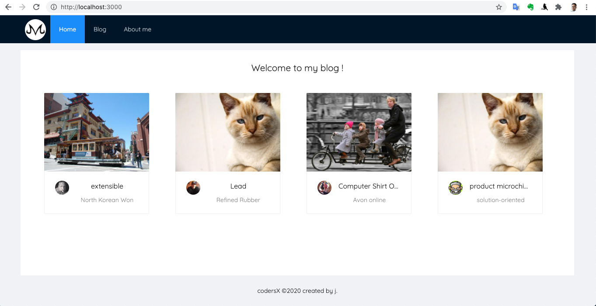
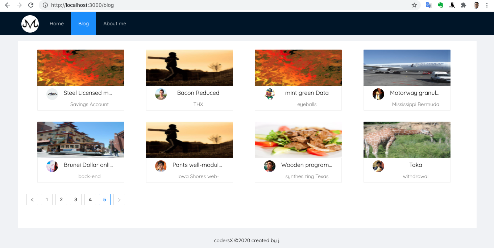
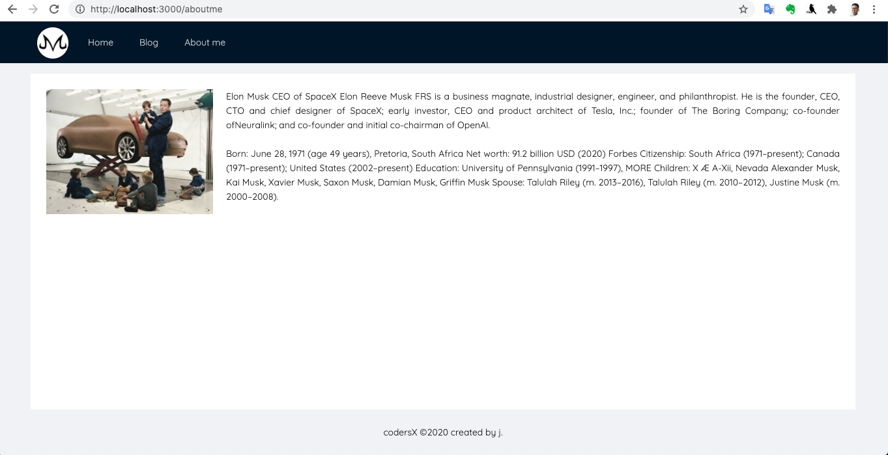

## BÀI 1

+ [ ] 1) Remix https://glitch.com/~codersx-react-template
+ [ ] 2) Sử dụng React router để tạo một trang blog cá nhân của bạn.
+ [ ] 3) Trang này có một component Header, có chứa 2 component con là Logo, MainMenu
+ [ ] 4) MainMenu chứa các đường link: Trang chủ, Blog, About me
+ [ ] 5) Trang chủ hiển thị 4 bài blog mới nhất
+ [ ] 6) Trang Blog hiển thị tất cả các bài viết có kèm pagination
+ [ ] 7) Trang About me giới thiệu về bạn
- Bonus nếu có thể kết hợp API server tự viết bởi bạn
- Bonus nếu bạn sử dụng một thư viện component nào đó
Home

Blog

About
